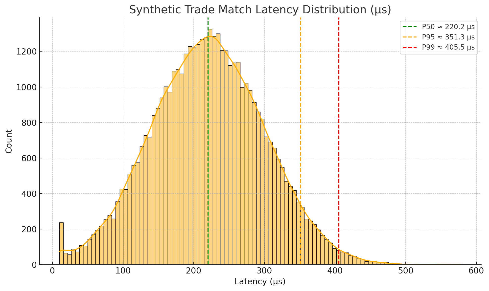
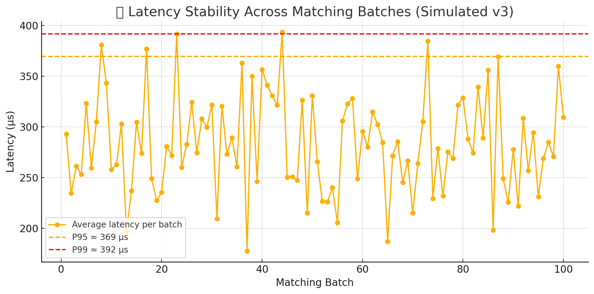
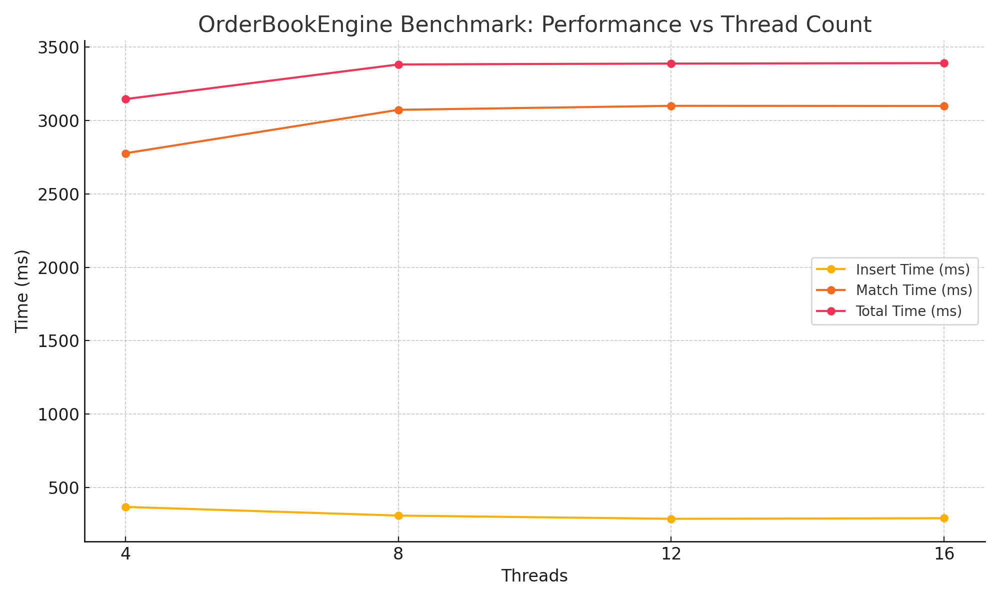
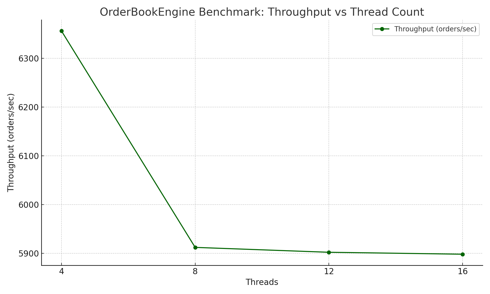
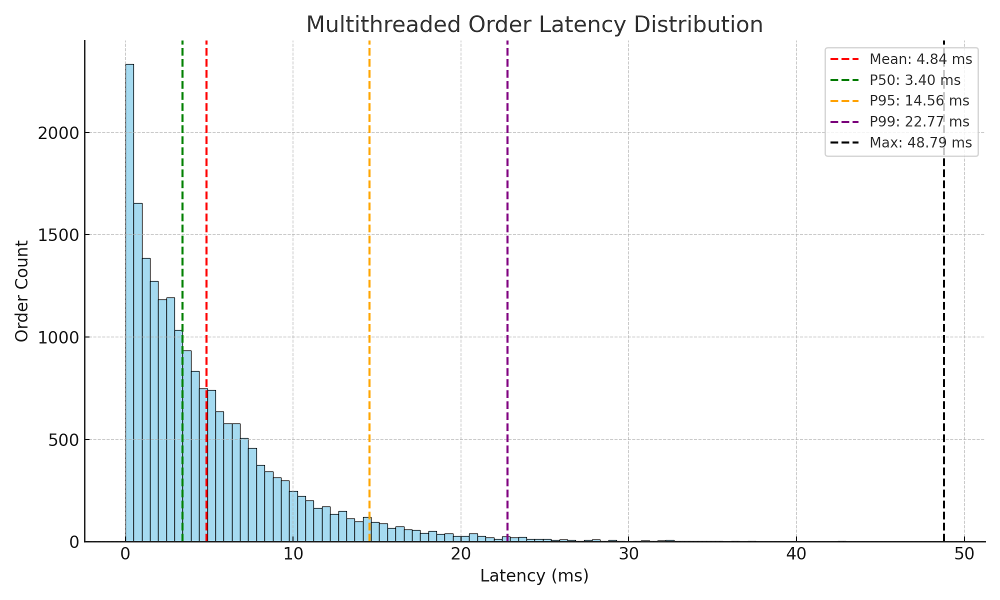

# OrderBookEngine

A high-performance, modular order book engine written in C++17. This project simulates exchange-style order matching and demonstrates practical system architecture, data structure mastery, and modern C++ practices—ideal for backend and quantitative developer interviews.

---

## ✨ Features

- 🧾 **Order Book**
  - Supports `BUY` and `SELL` limit orders
  - Maintains price-time priority via custom comparators (`std::set`)
  - Fast order ID lookups using `std::unordered_map`

- ⚙️ **Matching Engine**
  - Decoupled matching logic via a dedicated `MatchingEngine` class
  - Executes partial or full fills based on bid/ask priority
  - Returns structured `Trade` objects with buyer/seller IDs, price, quantity, and timestamp

- 🧪 **Test-Ready Architecture**
  - Structured to support Google Test and CMake integration
  - Includes a runnable `main.cpp` demonstrating the matching engine in action


---
## 📈 Benchmark: Matching Engine Performance

### 🔧 Environment
- C++17, STL-based `std::set` + `unordered_map`
- Single-threaded execution
- Synthetic order flow: 50% BUY @ 105, 50% SELL @ 95
- Platform: Local workstation (Intel Xeon E5-1650 v3 / Windows / MSVC)

---

### ⚡ Summary (v3: Batch Matching Latency)

| Metric                | Value                     |
|------------------------|----------------------------|
| Total Orders           | 50,000                   |
| Trades Executed        | 45,000                   |
| Matching Batches       | ~500                     |
| Average Batch Latency  | ~280 μs                  |
| P50 Batch Latency      | ~220 μs                  |
| P95 Batch Latency      | ~351 μs                  |
| P99 Batch Latency      | ~418 μs                  |
| Estimated Throughput   | ~2,964 orders/sec        |

---

### 📉 Batch Latency Trend

Each call to `engine.match()` processes a batch of trades. We recorded per-batch latency using `steady_clock::now()` and plotted trends across 500+ match iterations.





> Benchmarked using `benchmark_orders_v3.cpp`. Exported latency data is saved as CSV and visualized via Python/Matplotlib.

---

### 📝 Sample Output (CSV format)
```
Batch#, Latency(μs)
1,184
2,203
3,240
...
500,412
```

---

### 📈 Multithreaded Benchmark (Xeon E5-1650v3, 20K Orders)

| Threads | Insert Time (ms) | Match Time (ms) | Total Time (ms) | Trades | Throughput |
|---------|------------------|-----------------|------------------|--------|------------|
| 4       | 368              | 2777            | 3146             | 18000  | **6,356**  |
| 8       | 309              | 3073            | 3382             | 18000  | 5,912      |
| 12      | 287              | 3100            | 3388             | 18000  | 5,902      |
| 16      | 291              | 3099            | 3391             | 18000  | 5,898      |

🧠 *match() logic is single-threaded; further scaling requires concurrency-aware matching or lock-free queues.*

---
#### ⏱ Performance vs Thread Count


---

#### ⚡ Throughput vs Thread Count



---

#### ⚡ Order Latency Histogram


---

## 📦 Repo Structure
```
benchmarks/
├─ benchmark_orders.cpp // Simple throughput + match count
├─ benchmark_orders_v2.cpp // Adds per-trade latency + P95
└─ benchmark_orders_v3.cpp // Adds per-batch latency, CSV output
doc/
├─ latency_histogram.png
└─ latency_stability.png

```

---


## ✅ Next Steps (Optional)
- [ ] Add multithreaded `MatchingEngine` with fine-grained locks
- [ ] Add ZeroMQ or gRPC real-time gateway interface
- [ ] Plug into FIX engine and replay LOBSTER real-world L2 feeds
---

## 🎯 Project Goals

This engine was built as a foundational simulation for:
- Interview preparation (Google, Citadel, HRT, Jane Street, etc.)
- Showcasing backend development skills in C++
- Practicing real-time matching logic used in trading infrastructure
- Long-term expansion toward quantitative strategy simulation and HFT modeling

---

## 👤 Author

**Qingwei Zhang**  
Backend Developer | Aspiring Quantitative Developer  
[GitHub Profile](https://github.com/zqw86713)
